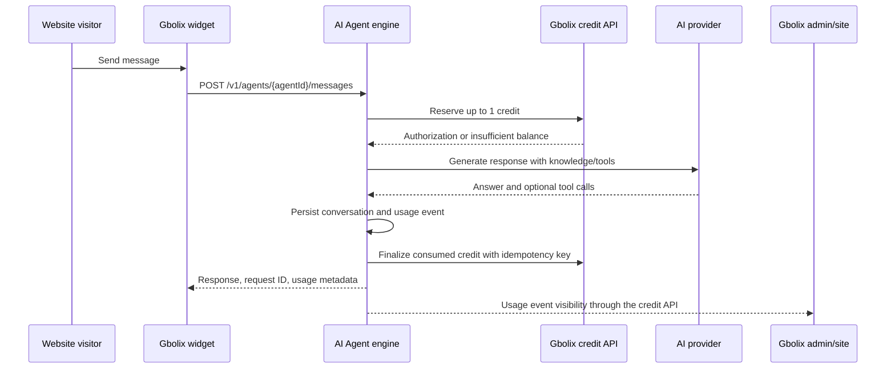

# Gbolix AI Agent — Shared Architecture and Integration Contract

## Product boundary

Gbolix AI Agent is a configurable digital-worker platform. The engine owns agent execution, conversations, knowledge retrieval, tool permissions, deployment tokens, and usage events. The Gbolix site remains the system of record for identity, workspaces, subscriptions, payments, and the authoritative credit ledger.

The V1 implementation prioritizes seven capabilities from the blueprint: agent creation, agent configuration, knowledge management, AI conversations, safe tool calling, an agent playground, and website deployment. The first deployment channels are the embedded website widget and a developer-facing HTTP API. WhatsApp, Telegram, WordPress, CRM integrations, and scheduled workflows remain extension points rather than V1 dependencies.

## Service boundaries

| Responsibility | Gbolix site | Gbolix AI Agent engine |
| --- | --- | --- |
| Authentication and user identity | Owns Clerk session and workspace membership | Verifies signed identity assertions or trusted service tokens; never creates a second customer identity system |
| Tenant ownership | Owns workspace/account mapping | Stores `organizationId`/`workspaceKey` on every tenant-owned record and enforces it on every query |
| Billing and payments | Owns plans, Paystack/payment state, invoices, and product entitlements | Does not charge customers or mutate balances directly |
| Credit balance | Owns the authoritative wallet and ledger | Requests a one-credit authorization before a billable completion and sends a usage/finalization event after success |
| Agent configuration | Provides the customer workspace UI and proxies authenticated requests | Persists agent configuration, versions, knowledge, tools, deployments, and runtime settings |
| AI execution | Hosts the product UI and account context | Calls the configured OpenAI-compatible provider, runs the tool loop, records usage, and returns the response |
| Admin visibility | Provides the global Gbolix admin workspace | Exposes privileged aggregate and drill-down data only to configured admin identities |

## Request flow



A failed model or tool execution must release or cancel the reservation and must not consume a customer credit. A successful response consumes one V1 credit, regardless of the number of internal model/tool steps, unless the site later introduces a different metering policy.

## Engine API surface

| Endpoint | Auth | Purpose |
| --- | --- | --- |
| `GET /healthz` | Public | Render health check and dependency status |
| `POST /v1/agents` | Bearer identity token | Create an agent for the caller’s workspace |
| `GET /v1/agents` | Bearer identity token | List the caller’s agents |
| `GET /v1/agents/{agentId}` | Bearer identity token or public deployment token | Read an agent’s public-safe configuration |
| `PATCH /v1/agents/{agentId}` | Bearer identity token | Update instructions, tone, model, status, and welcome text |
| `DELETE /v1/agents/{agentId}` | Bearer identity token | Archive an agent |
| `POST /v1/agents/{agentId}/knowledge` | Bearer identity token | Add text knowledge to an agent |
| `GET /v1/agents/{agentId}/knowledge` | Bearer identity token | List knowledge sources |
| `DELETE /v1/agents/{agentId}/knowledge/{knowledgeId}` | Bearer identity token | Remove a knowledge source |
| `POST /v1/agents/{agentId}/messages` | Bearer identity token or deployment token | Run the agent and persist the conversation |
| `GET /v1/agents/{agentId}/conversations` | Bearer identity token | List conversations for the workspace |
| `GET /v1/conversations/{conversationId}` | Bearer identity token | Read a conversation transcript |
| `POST /v1/agents/{agentId}/deployments` | Bearer identity token | Issue/reissue a website deployment token and embed snippet |
| `GET /v1/agents/{agentId}/deployments` | Bearer identity token | List deployments |
| `POST /v1/agents/{agentId}/api-keys` | Bearer identity token | Create a developer API key; plaintext is returned once |
| `GET /v1/agents/{agentId}/usage` | Bearer identity token | Workspace-scoped usage summary and recent events |
| `GET /v1/admin/overview` | Admin identity token | Global customer, agent, response, usage, and deployment aggregates |
| `GET /v1/admin/customers` | Admin identity token | Global customer/tenant list |
| `POST /v1/internal/credit-authorizations` | Internal service token | Reserve one or more credits through the Gbolix site |
| `POST /v1/internal/usage-events` | Internal service token | Deliver usage and credit-finalization events to the Gbolix platform |
| `GET /widget.js` | Public | Serve the embeddable website widget loader |
| `GET /widget` | Public | Serve the widget UI shell |

## Identity and tenant isolation

The engine accepts a short-lived bearer token from the Gbolix site or a deployment/API credential. For the initial integration, the site can pass these claims in a signed JWT: `sub`, `workspaceId`, `workspaceKey`, `role`, `email`, and `iss`. The engine must reject requests without a verified identity or a valid public deployment token, and every query must be scoped by the resolved workspace.

The public widget only receives an opaque deployment token that identifies one active deployment. It must never receive a workspace-wide API key, provider secret, database credential, or admin claim. Admin endpoints are limited to identities whose subject appears in `AGENT_ADMIN_USER_IDS` or to a trusted internal service token.

## V1 data model

| Record | Required fields | Notes |
| --- | --- | --- |
| Agent | `id`, `workspaceId`, `name`, `description`, `instructions`, `tone`, `model`, `status`, `welcomeMessage`, timestamps | Status is `draft`, `active`, `paused`, or `disabled` |
| Agent version | `agentId`, `version`, immutable configuration snapshot, `publishedAt` | V1 stores the current configuration and leaves version history ready for expansion |
| Knowledge source | `id`, `agentId`, `title`, `content`, `sourceType`, `status`, timestamps | V1 uses text retrieval; files and URL ingestion can reuse the same interface later |
| Conversation | `id`, `agentId`, `workspaceId`, `channel`, `visitorKey`, `status`, timestamps | Status includes `open`, `resolved`, and `handoff` |
| Message | `conversationId`, `role`, `content`, `toolName`, `createdAt` | Stores user, assistant, system, and tool messages |
| Tool configuration | `agentId`, `toolKey`, `enabled`, `approvalMode`, JSON settings | V1 supports safe built-in lead/contact capture tools |
| Deployment | `id`, `agentId`, `channel`, `publicTokenHash`, `allowedOrigin`, `status`, timestamps | Plaintext token is shown only when created/reissued |
| API key | `id`, `agentId`, `workspaceId`, `keyPrefix`, `keyHash`, `status`, timestamps | Plaintext is returned once and never stored |
| Usage event | `requestId`, `workspaceId`, `agentId`, `conversationId`, `model`, token counts, tool count, `credits`, `status`, timestamps | Idempotent by `requestId` and credit event key |

## Provider abstraction

The engine uses an OpenAI-compatible client behind a small provider interface. The selected model is stored on the agent, but the engine does not hard-code a single vendor. The runtime reads `OPENAI_API_KEY`, `OPENAI_BASE_URL`, and `DEFAULT_MODEL` from environment variables. A future provider adapter can implement the same `complete()` contract.

The tool loop is bounded by `MAX_TOOL_ROUNDS` and only exposes tools explicitly enabled on the agent. Read/search tools can run automatically. Side-effecting tools require an approval policy and are not enabled by default. The V1 built-ins are deterministic local tools: `capture_contact` and `create_lead`, which write structured activity records rather than sending external messages.

## Credit contract

The engine uses a reservation/finalization model to avoid charging failed requests:

```json
{
  "requestId": "req_01J...",
  "workspaceId": "workspace_123",
  "agentId": "agent_123",
  "maximumCredits": 1,
  "sourceType": "gbolix_ai_agent",
  "sourceKey": "agent_123:req_01J..."
}
```

The site is authoritative. If the credit service is unavailable in local development, the engine can run in explicit `CREDIT_MODE=local` with an in-memory balance for smoke tests. Production should use `CREDIT_MODE=platform` and require `GBOLIX_PLATFORM_URL` plus `GBOLIX_PLATFORM_TOKEN`.

## Render deployment shape

The engine is a standalone web service with a persistent Postgres database. Render should run the engine from the AI Agent repository using `npm install`, `npm run build`, and `npm start`. The site remains a separate web service. The engine’s public URL is placed in the site’s `VITE_GBOLIX_AGENT_URL` variable; the engine receives the site’s internal credit URL and shared service token through private environment variables.

The engine must expose `/healthz`, bind to `0.0.0.0`, use CORS allowlisting for the Gbolix site and configured customer origins, and use database migrations before serving production traffic. Secrets must be configured in Render’s environment settings, never committed to either repository.

## Deliberate V1 exclusions

The first build does not attempt to deliver every future channel or automation. WhatsApp, Telegram, Slack, Shopify, CRM connectors, arbitrary web browsing, voice, mobile SDKs, recurring jobs, autonomous email sending, refunds, deletion, and direct credit balance mutation remain outside V1. The interfaces are designed so those features can be added without changing the widget or the core conversation endpoint.

## Source material

The product requirements in this document are based on the user-provided blueprint and the current public repositories:

- [Gbolix AI Agent product blueprint](file:///home/ubuntu/upload/GbolixAIAgentproductblueprint.docx)
- [Gbolix site repository](https://github.com/alexgbolahan021-debug/Gbolix)
- [Gbolix AI Agent repository](https://github.com/alexgbolahan021-debug/Gbolix-AI-Agent-Product)
